## What This Is

A collection of ready-to-use screenspace shaders for TF2 that can be activated via HUD elements.

<details open>
<summary><h2>Example Screenshots</h2></summary>

### Blur
<div style="overflow-x: auto; white-space: nowrap;">
  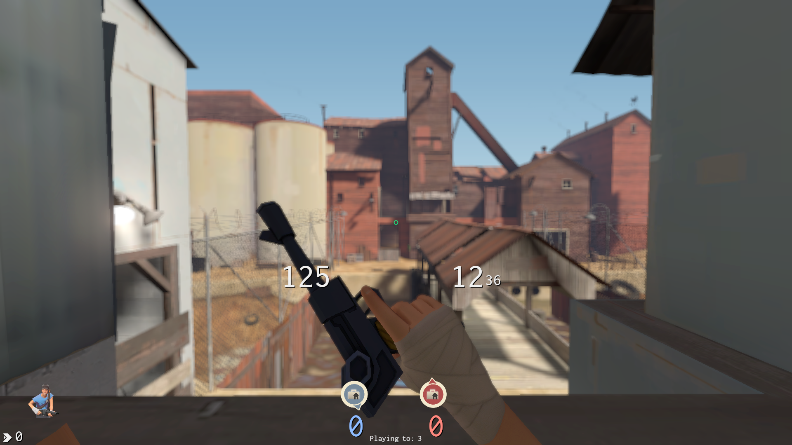
  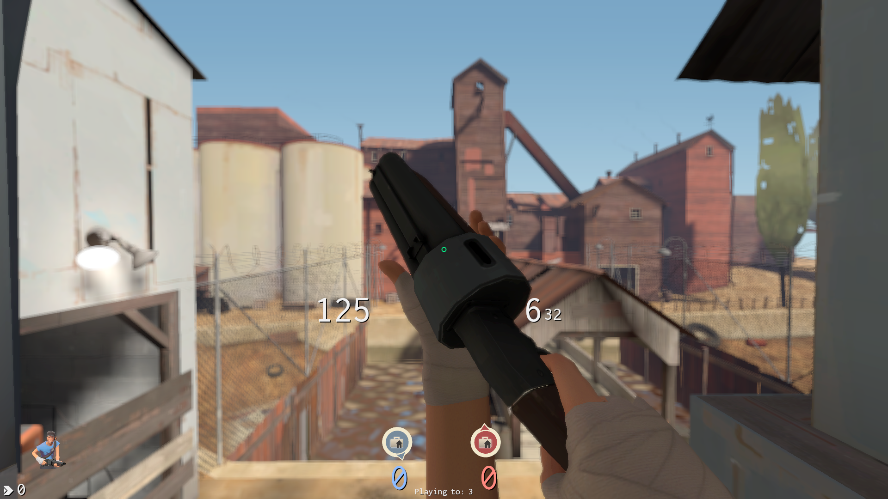
</div>

### Cel
<div style="overflow-x: auto; white-space: nowrap;">
  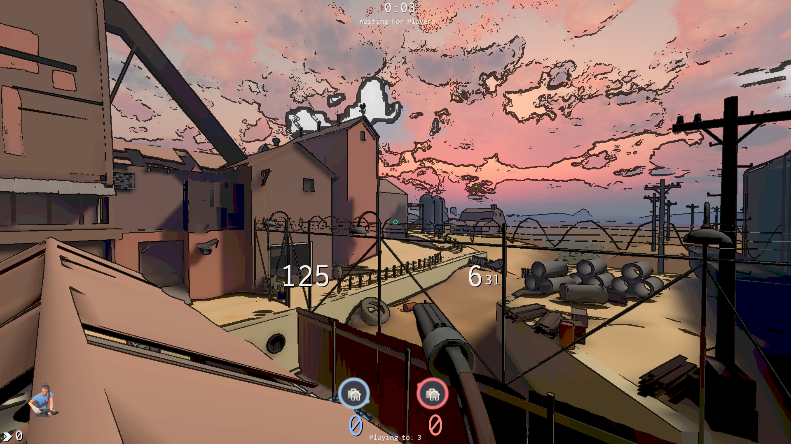
  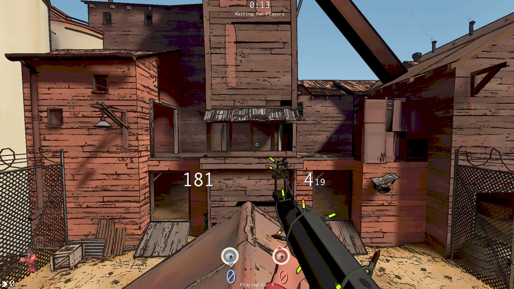
</div>

### Rain
<div style="overflow-x: auto; white-space: nowrap;">
  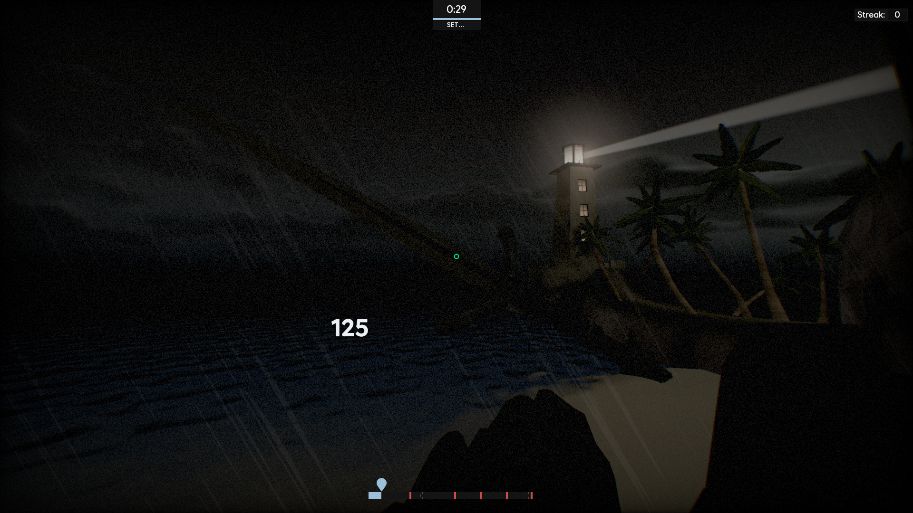
  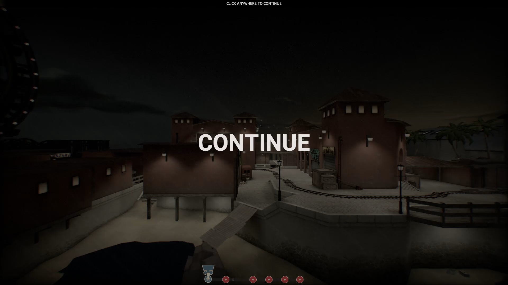
</div>

### Sepia
<div style="overflow-x: auto; white-space: nowrap;">
  
  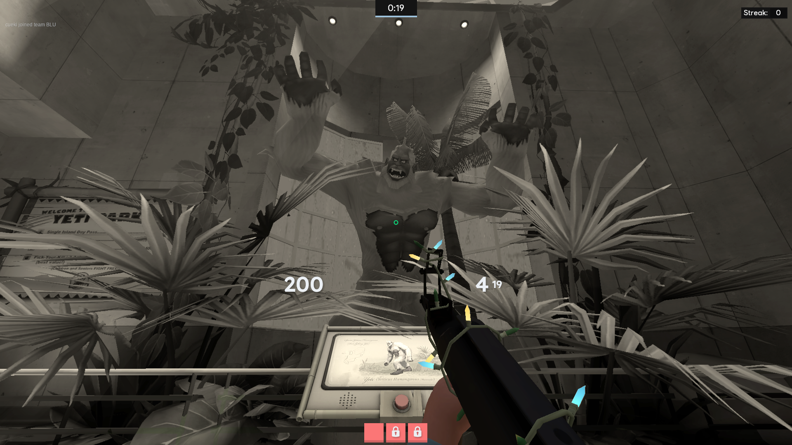
</div>

### Paint
<div style="overflow-x: auto; white-space: nowrap;">
  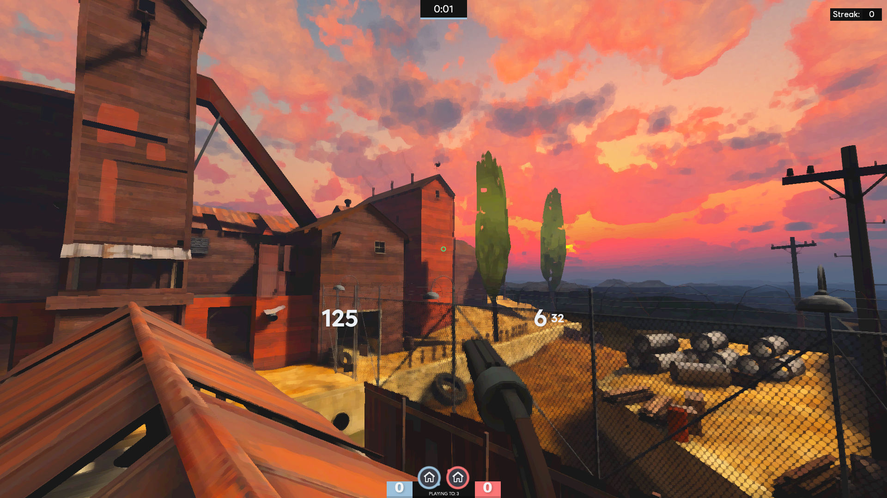
  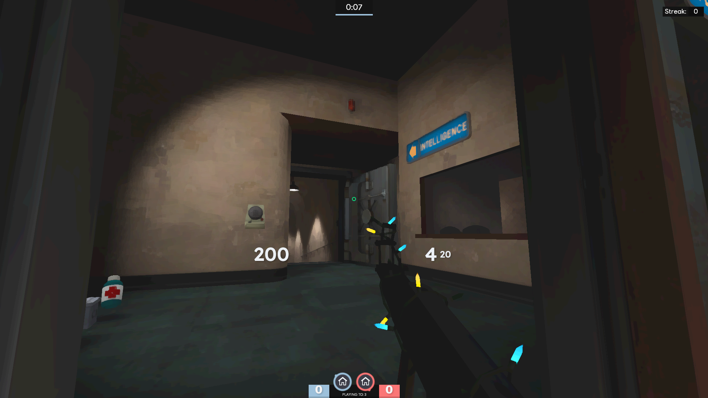
</div>

### PSX
<div style="overflow-x: auto; white-space: nowrap;">
  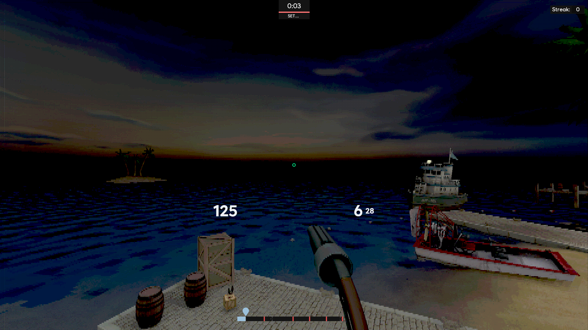
  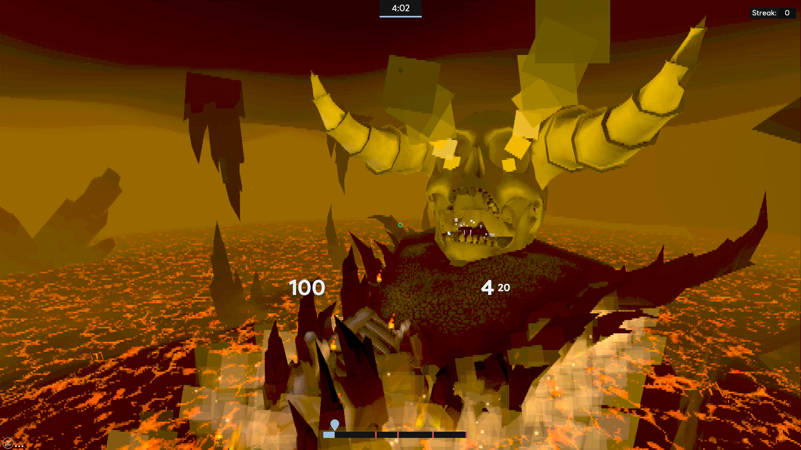
</div>

### Red
<div style="overflow-x: auto; white-space: nowrap;">
  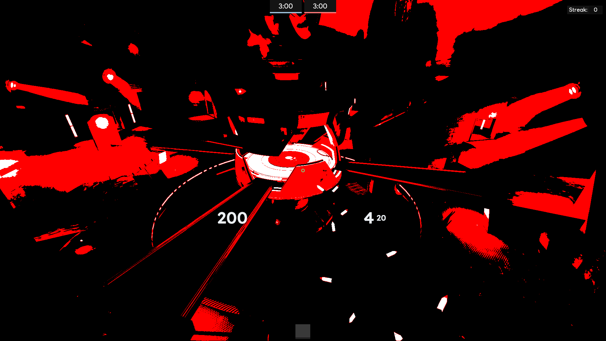
  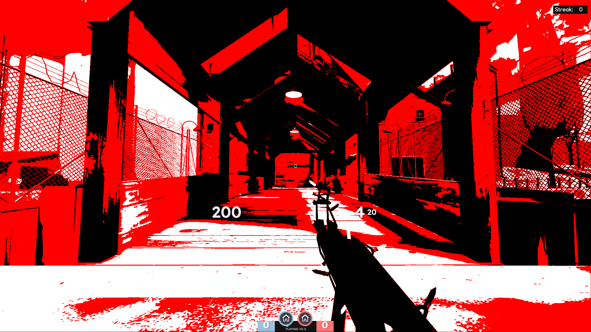
</div>

### Fullbright
*WIP, Screenshots coming soon...*

### Halftone
*WIP Screenshots coming soon...*

</details>

### Required Game Setting

Add to your `autoexec`:
```
`mat_viewportscale 0.9999999`
```

**This is mandatory for `_rt_FullFrameFB1`.** Without it, shaders will show black/white screens.

`mat_viewportscale 0.9999999` enables upscaling post-processing pipeline. `_rt_FullFrameFB1` is only populated by `CopyRenderTargetToTextureEx()`, which only runs if `mat_viewportscale` < 1. If `mat_viewportscale 1`, then the function never runs and the framebuffer never gets copied.

In simpler terms, we are hijacking the upscale post-process with our own shader.

Note: `_rt_PowerOfTwoFB` doesn't require this, it's populated on-demand via `CopyRenderTargetToTexture()` when materials request it.

### Important Note! (Please Read)
There are a couple of different framebuffers we can access, depending on settings. Here are some things to consider.

**For `_rt_FullFrameFB`:**
- Change `_rt_FullFrameFB1` to `_rt_FullFrameFB` in the VMTs and set `mat_hdr_level 1` instead of `mat_viewportscale`. Unfortunately, this does not work on all maps, and adds its own post processing that might interfere with the desired effect. 
- Or enable motion blur with `mat_motion_blur_enabled 1` and disable it visually with `mat_motion_blur_strength 0`. This ensures the `_rt_FullFrameFB` framebuffer exists, however, it is created without the viewmodel, so the viewmodel might not exist/be transparent with the alpha.

**For `_rt_PowerOfTwoFB`:**
- Use `_rt_PowerOfTwoFB` instead of `_rt_FullFrameFB`. This framebuffer is used for depth calculations earlier in the pipeline, it always exists. Unfortunately it is a 1024x1024 image and therefore the mapping of pixels is not as clear as the full resolution framebuffer. It also does not contain the viewmodel. On the plus side you can use it without `mat_hdr_level 1` or `mat_viewportscale`, so if you are doing hud overlays instead of fullscreen shaders it might be a better option.

**To disable the shader:**
- Disable the ImagePanel with `"visible" "0"` and `"enabled" "0"`, then refresh the hud with `hud_reloadscheme`.

### Installation

1. Shader files go into folder to `hud/shaders/fxc/`
2. VMT files go in `hud/materials/vgui/replay/thumbnails/`
3. Activate via HUD ImagePanel or console commands (sv_cheats 1 only)

### ImagePanel
*Inside of scripts/hudlayout.res*

```
CustomShaderOverlay
{
    "ControlName"   "ImagePanel"
    "xpos"          "0"
    "ypos"          "0"
    "zpos"          "-10000"
    "wide"          "f0"
    "tall"          "480"
    "scaleimage"    "1"
    "image"         "replay/thumbnails/shader_vmt_name"
    "visible"       "1"
    "enabled"       "1"
}
```
## Creating New Shaders

Use [sdk_screenspace_shaders](https://github.com/ficool2/sdk_screenspace_shaders) for shader compilation.

**Basic process:**
1. Write `.hlsl` shader
2. Compile to `.vcs`
3. Create `.vmt` material file
4. Reference in HUD

### VMT Template

```
"screenspace_general"
{
    // No need for the b at the end of the filename
    $pixshader   "yourshader_ps20"
    $basetexture "_rt_FullFrameFB"
    
    // Optional extra textures you can pass to the shader
    // $texture1    ""
    // $texture2    ""
    // $texture3    ""

    $x360appchooser 1     // Required for vertex transformations
    
    // $copyalpha is only needed if you wish to pass the alpha through to the shader
    // I would just keep it enabled always...
    $copyalpha                 1
    $ignorez                   1
    
    // 16 customizable parameters that are passed to the shader
    $c0_x     0.0
    $c0_y     0.0
    $c0_z     0.0
    $c0_w     0.0
    // ...this block repeats 3 more times with the number after $c incrementing by 1

    "<dx90"
    {
        $no_draw 1
    }
}
```

### Animating Parameters

Shaders with time parameters (like rain) auto-update via CurrentTime proxy:

```
Proxies
{
    CurrentTime
    {
        resultVar   $c0_x
    }
}
```

### Using Depth for Masking

The alpha channel of any `_rt_FullFrameFB` contains depth information. You can use this to exclude nearby objects (viewmodel, floor) from shader effects.

**Approach 1: VMT-level**

Set `$copyalpha 0` in your VMT. The material system will use alpha for depth-based blending, automatically excluding viewmodels and creating a distance-based falloff.

```
$copyalpha 0  // Depth-based exclusion
```

**Approach 2: Shader-level (manual threshold)**

Implement depth masking in your shader code with `$copyalpha 1`:

```hlsl
float4 baseColor = tex2D(TexBase, i.uv);

// Skip nearby objects (alpha < threshold)
if (baseColor.a < depthThreshold)
{
    return baseColor; // Don't apply effect to nearby objects
}

// Apply effect to distant objects only
float4 processed = applyEffect(...);
return float4(processed.rgb, baseColor.a);
```

VMT parameter for threshold control:
```
$copyalpha 1
$c0_y     0.3  // Depth threshold (0.0-1.0)
```

This creates a hard cutoff at the threshold value.

## Development Notes

### Framebuffers

`_rt_FullFrameFB` - Native screen resolution. Includes viewmodels. **Alpha channel contains basic depth information** (low alpha = near, high alpha = far).

`_rt_FullFrameFB1` - Same as `_rt_FullFrameFB` but only exists with `mat_viewportscale 0.9999999`. As such, it is not the native resolution (ie 1920x1080 -> 1919x1079)

`_rt_PowerOfTwoFB` - Allocated as 1024x1024 texture. Lower quality compared to FullFrameFB. Viewmodels not included. Also has depth in alpha channel.

`_rt_FullFrameDepth` - Just an alias for `_rt_PowerOfTwoFB`.

### Color Behavior

There is an unavoidable tonemap applied due to `mat_hdr_level 1` that compresses color multipliers:
- 2.0x multiplier → ~1.3x actual brightness
- 4.0x multiplier → ~1.7x actual brightness

Effects requiring precise color math will be affected by this compression.

### VMT Parameters

**Required:**
- `$pixshader "name_ps20"` - Shader to use
- `$basetexture "_rt_FullFrameFB1"` - Texture input
- `$x360appchooser 1` - Required for shader to display

**Alpha handling:**
- `$copyalpha 1` - Preserves framebuffer alpha (depth). Shader effect applies to everything including viewmodels and nearby objects.
<div style="overflow-x: auto; white-space: nowrap;">
  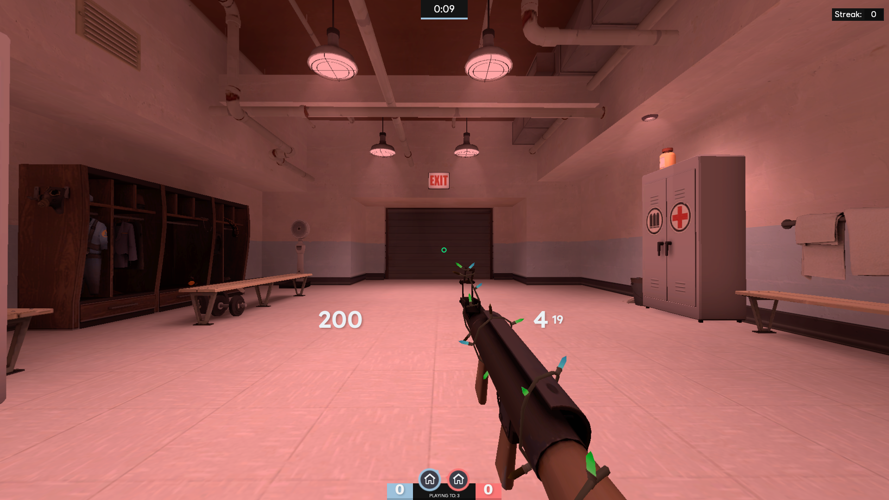
</div>

- `$copyalpha 0` - Material system uses alpha for depth-based blending. Shader does not apply to viewmodels and nearby objects.
<div style="overflow-x: auto; white-space: nowrap;">
  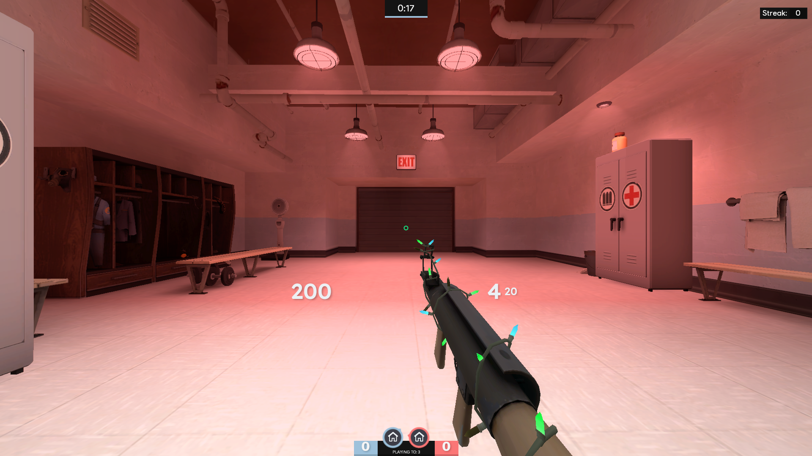
</div>

**Parameters:**
- `$c0_x` through `$c3_w` - 16 customizable shader parameters (4 float4 constants)

**Color space (for framebuffer processing):**

Reading from `_rt_FullFrameFB` (gamma-corrected):
- `$linearread_basetexture 1` - Reads texture as linear instead of sRGB. Causes washed out appearance.
- `$linearwrite 1` - Writes output as linear instead of sRGB. Causes darkening.

Linear color flags are intended for UI shaders that use custom textures or constant colors (non-framebuffer content) to prevent double gamma correction. For shaders processing `_rt_FullFrameFB`, I think its safe to omit these flags.

**Other:**
- `$ignorez 1` - Appears to have no effect for what we are doing.

## Limitations

### What Shaders CAN'T Do

**Temporal effects** - No frame history

**SSAO** - No geometry/normal data

**Reflections** - No environment data

**Most *real* depth** - Depth buffer is limited

### What Shaders CAN Do

**Color grading** - Sepia, contrast, saturation, tinting

**Blur/sharpen** - Spatial filtering

**Edge detection** - Cel shading, outlines

**Distortion** - Chromatic aberration, lens effects

**Procedural effects** - Rain, grain, noise

**Animated effects** - Using time parameter

**Vignettes** - Darkening edges


### Performance Notes

- Pixel shaders run **every frame, every pixel**
- The instruction limit is low so be careful with loops
- Keep texture samples low (expensive)

## Resources

**All credits go to:**
- **Shader Compilation:** [sdk_screenspace_shaders](https://github.com/ficool2/sdk_screenspace_shaders)

**Useful:**
- **HLSL Reference:** [Microsoft HLSL Docs](https://docs.microsoft.com/en-us/windows/win32/direct3dhlsl/dx-graphics-hlsl)
- **Shader Inspiration:** [ShaderToy](https://www.shadertoy.com/)
